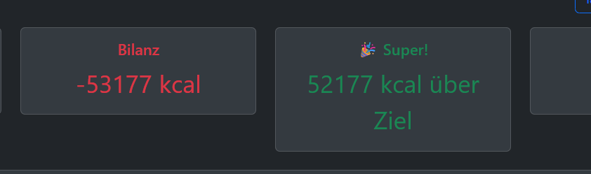

TODO:

FRONDEND:

1. TODO Kcal Goal anpassen so das es für Alle Perioden funktioniert

2. TODO Protein und Kohlenhydrate funktionalität zuende bringen (in modal und data-table bereits implementiert)

3. TODO Sortierung von datumsangaben wird local nicht geupdatet (kleineres datum vom monat her wird unten gespeichert in der datenbank jedoch
   richtig sortiert und beim nächsten laden auch richtig angezeigt --> locales sortieren im cache!)

4. TODO Modularisierung Abschließen
5. TODO scaling der seite verbessern 
6. TODO Bessere organisiation der Funktionen und potenzielle weitere auslagerung

7. TODO die render_chart funktion aufteilen und übersichtlicher machen

8. TODO Authentifizierungs bug fixen

9. TODO CACHE BEIM LÖSCHEN VON ABHÄNIGKEITEN (FOODS ODER EXCERCIESE TYPES UPDATEN SO DAS DIE DARAUS RESULTIEREND GELÖSCHTEN CONSUMPTIONS UND ACTIVITYS AUCH GELÖSCHT WERDEN)

BACKEND:

1. TODO Protein und Kohlenhydrate funktionalität zuende bringen (in modal und data-table bereits implementiert)

DATENBANK:

1. TODO: wir benötigen eine locale datenbank wie SQLite damit wir sychron sachen testen können, das machst du David!
